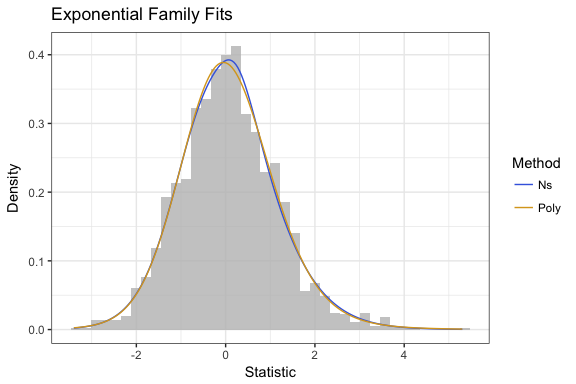
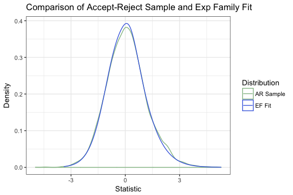
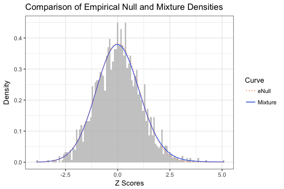
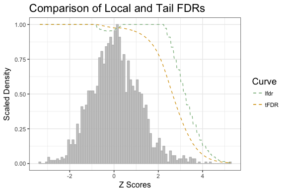

# README
Zachary McCaw  
`r Sys.Date()`  

# Package Vignette


## Contents

* [Mixture Density](#mixture-density)
* [Null Density](#null-density)
* [Local FDR](#local-fdr)

## Mixture Density

#### Density Estimation

A sample $(z_{i})$ of $n=2\times 10^{3}$ variates is drawn from the following distribution with $\pi_{0}=0.95$:

$$
(1-\pi_{0})N(0,1) + \pi_{0}N(2,1)
$$

An exponential family density of order $l=5$ is fit to the sample by using 1. a natural spline basis, with knots on the sample quantiles, and 2. an orthogonal polynomial basis.  

```r
library(LFDR);
# Generate Z's
Data = genMixZ(pi0=0.95,mu1=2,n=2e3,symm=F);
z = Data[,"z"];
# Fit density via natural splines
fit.ns = fitNsDens(z=z,k=60,l=5);
# Fit density via orthogonal polynomials
fit.poly = fitPolyDens(z=z,k=60,l=5);
```



#### Density Sampling

A sample $(z_{i}^{*})$ of size $n=10^{4}$ is drawn from fitted exponential family using the accept-reject (AR) method. The proposal distribution is normal, centered on the mean of the $(z_{i})$, with twice the standard deviation of the $(z_{i})$. A kernel estimate of the AR density is compared with the fitted exponential family. 

```r
library(doMC);
registerDoMC(cores=4);
# Sample fitted density
S = sampleFit(f=fit.ns$f,m=mean(z),s=2*sqrt(var(z)),n=1e4,R=Range(z),parallel=T);
```



The AR sample $(z_{i}^{*})$ allows for estimation of moments for the fitted exponential family. To match the generative model, the AR sample should have mean $2\pi_{0} = 0.1$ and variance $1+4\pi_{0} = 1.2$:


```r
# Mean of AR sample
round(mean(S),digits=3);
# Variance of AR sample
round(var(S),digits=3);
```

```
## [1] 0.081
## [1] 1.269
```

## Empirical Null Density

#### Truncated Noraml Distribution
A sample of size $n=10^{4}$ is generated from a normal distribution with mean $\mu=0$ and standard deviation $\sigma=2$. The following demonstrates recovery of the location and scale $(\mu,\sigma)$ via maximum likelihood.  


```r
# Simulate truncated normal data
z.tn = truncnorm::rtruncnorm(n=1e4,mean=0,a=-1,b=3,sd=2);
# Estimate parameters
theta = fitTruncNorm(z=z.tn,a=-1,b=3,trace=T);
cat("Estimated location:\n");
cat(round(theta$mu,digits=2));
cat("\n");
cat("Estimated scale:\n");
cat(round(theta$sigma,digits=2));
cat("\n");
```

```
## Initial Likelihood: -4268.83
## Final Likelihood: -4268.75
## Overall Likelihood Improvement: 0.077
## Estimated location:
## -0.02
## Estimated scale:
## 2.02
```

#### Estimate Empirical Null

Parameters for an empirical null distribution $f_{0} = N(\mu_{0},\sigma_{0}^{2})$, and the null proportion $\pi_{0}$, are estimated either by central matching `CM` or maximum likelihood `ML`. In either case, the limits of a null neighborhood $\mathcal{N}_{0} = [a,b]$, in which the alternative density $f_{1}$ is taken as having no support, are specified. The null parameters $(\mu_{0},\sigma_{0}^{2})$ are estimated using the $z$ scores falling in $\mathcal{N}_{0}$. In central matching, $\mathcal{N}_{0}$ is partitioned as $a = \xi_{0} < \cdots < \xi_{K} = b$. The log mixture density at the evaluation points $\ln\hat{f}(\xi_{k})$ is regressed on a quadratic function of the evaluation points $\beta_{0} + \beta_{1}\xi_{k} + \beta_{2}\xi_{k}^{2}$. The parameters of interest $(\mu_{0},\sigma_{0}^{2},\pi_{0})$ are functions of $(\beta_{0},\beta_{1},\beta_{2})$. In maximum likelihood, $(\mu_{0},\sigma_{0}^{2})$ are estimated by fitting a truncated normal distribution to $\mathcal{N}_{0}$. The null proportion is obtained from $(\mu_{0},\sigma_{0}^{2})$ and the proportion of $z$ scores falling in $\mathcal{N}_{0}$. 


```r
# Estimation by central matching
en.cm = eNull(z=z,a=-1.5,b=1.5,method="CM",f=fit.poly$f);
# Estimation by maximum likelihood
en.ml = eNull(z=z,a=-1.5,b=1.5,method="ML");
# Tabulate estimates
A = round(rbind(as.numeric(en.cm),as.numeric(en.ml)),digits=2);
colnames(A) = c("Mean","Var","pi0");
print(A);
```

```
##       Mean  Var  pi0
## [1,] -0.01 1.01 0.97
## [2,]  0.01 1.20 1.03
```

#### Plotting

Below, the estimated mixture $f(z) = \pi_{0}f_{0}(z) + \pi_{1}f_{1}(z)$ and empirical null $f_{0}(z)$ densities are plotted with the histogram of $z$ scores. 


```r
# Empirical null density
f.en = function(x){dnorm(x,mean=en.ml$m0,sd=sqrt(en.ml$v0))};
# Mixuture and Empirical Null Densities
q = plotDens(z=z,f.mix=fit.poly$f,f.en=f.en);
q = q + ggtitle("Comparison of Empirical Null and Mixture Densities");
print(q);
```



## Local FDR

The local false discovery rate (fdr) at $z_{0}$ is an estimate of the posterior probability that $z_{0}$ arose from the null density $f_{0}$:

$$
\text{fdr}(z_{0}) = \frac{\pi_{0}f_{0}(z_{0})}{\pi_{0}f_{0}(z_{0}) + \pi_{1}f_{1}(z_{0})}
$$

In `LFDR`, the range of the $z$ scores is partitioned as $\min(z_{i}) = \xi_{0} < \cdots < \xi_{K} = \max(z_{i})$. Within each interval $I_{k} = [\xi_{k-1},\xi_{k})$, the expected number of null $z$ scores $N_{0}(I_{k}) = n\pi_{0}F_{0}(I_{k})$ is compared with the expected number of total $z$ scores $N(I_{k}) \approx n h_{k}\hat{f}(m_{k})$ to obtain an estimate of $\text{fdr}(z)$ for $z \in I_{k}$. Here $h_{k} = \xi_{k}-\xi_{k-1}$ is the interval length, and $m_{k} = (\xi_{k}+\xi_{k-1})/2$ is the interval midpoint. If an empirical null distribution has been estimated, $(\mu_{0},\sigma_{0}^{2},\pi_{0})$ are provided, else these default to $(0,1,1)$. In addition to local fdr mappings for the input $z$ scores, two functions are returned. `lfdr` estimates the local fdr, and `tFDR` estimates the tail area FDR. For $z_{0} > 0$, the tail area FDR is:

$$
\text{tFDR}(z_{0}) = E[\text{fdr}(Z)|Z\geq z_{0}] = \frac{\int_{z_{0}}^{\infty}\text{fdr}(z)f(z)dz}{\int_{z_{0}}^{\infty}f(z)dz}
$$


```r
# Local false discovery rate
L = LFDR(z=z,f=fit.poly$f,k=60,m=en.ml$m0,v=en.ml$v0,p0=en.ml$p0);
# fdr Assignments
cat("Local False Discovery Rate Mappings:\n");
head(L$Map);
cat("\n");
cat("Local False Discovery Rate at z0=3:\n");
round(L$lfdr(3),digits=2);
cat("\n");
cat("Tail False Discovery Rate at z0=3:\n");
round(L$tFDR(3),digits=2);
```

```
## Local False Discovery Rate Mappings:
##            z             zd      mp      lfdr
## 1  0.1496996   [0.08,0.225)  0.1525 0.9725726
## 2  0.8646307   [0.805,0.95)  0.8775 1.0000000
## 3 -0.2617044 [-0.355,-0.21) -0.2825 0.9528290
## 4  0.1313517   [0.08,0.225)  0.1525 0.9725726
## 5 -0.1031238 [-0.21,-0.065) -0.1375 0.9548765
## 6  1.3775998    [1.24,1.38)  1.3125 1.0000000
## 
## Local False Discovery Rate at z0=3:
## [1] 0.59
## 
## Tail False Discovery Rate at z0=3:
## [1] 0.33
```

#### Plotting

Below, the local and tail area false discovery rates are plotted with the histogram of $z$ scores. 


```r
# Local and tail false discovery rates
q = plotFDR(z=z,lfdr=L$lfdr,tFDR=L$tFDR);
q = q + ggtitle("Comparison of Local and Tail FDRs");
print(q);
```


