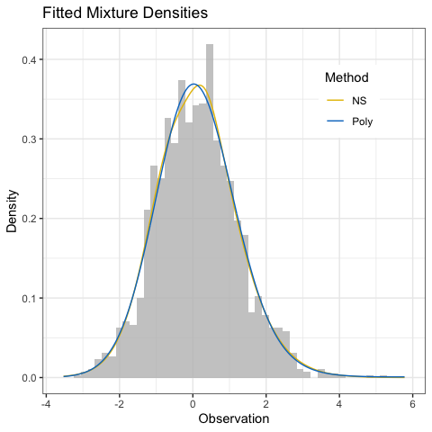
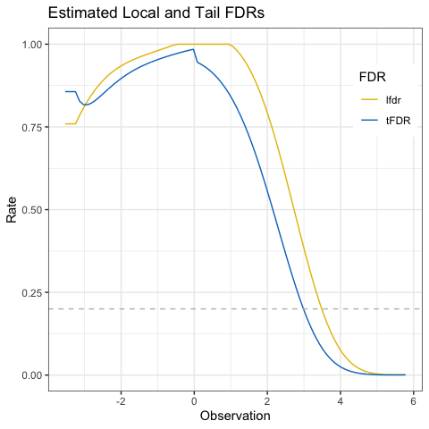

# LFDR: Local False Discovery Rate Estimation

[](https://github.com/zrmacc/LFDR/actions/workflows/R-CMD-check.yaml)

Zachary R. McCaw <br> Updated: 2026-03-06

# Package Vignette

# Contents

- [Background](#background)
- [Mixture Density](#mixture-density)
- [Null Density](#null-density)
- [Local FDR](#local-fdr)
- [End-to-end pipeline](#end-to-end-pipeline)
- [Summary table](#summary-table)

# Background

In large-scale testing (e.g., many genes, voxels, or hypotheses), we
observe a mix of null and non-null cases. Each statistic (often
converted to a z-score) is thought of as drawn from either a null
distribution or an alternative distribution. The **local false discovery
rate** (lfdr) at a value $\zeta$ is the posterior probability that an
observation with value $\zeta$ came from the null component. So the lfdr
is “local” because it depends on the exact observed value, not just on
whether the statistic exceeds some threshold.

This contrasts with the **tail false discovery rate** (tFDR), which
answers: among all observations as or more extreme than $\zeta$, what
fraction are expected to be null? The tFDR is the expected proportion of
false discoveries in the rejection region $\{Z \geq \zeta\}$ (or the
analogous left tail), and is the quantity controlled by procedures like
Benjamini–Hochberg when working with p-values. The local FDR is strictly
about the probability that a single observation at $\zeta$ is null; the
tail FDR averages over a region and is useful for choosing cutoffs and
reporting error rates for sets of discoveries.

To estimate either quantity we need: (1) the overall mixture density of
the observations, (2) the null distribution (location, scale, and
possibly proportion), and (3) the alternative only implicitly (via the
mixture and null). The rest of this vignette walks through estimating
the mixture density, fitting the empirical null, and then computing the
local and tail FDR curves.

# Mixture Density

## Density Estimation

Consider the following two-component normal mixture:

$$
\pi_{0}N(\mu_{0},\sigma_{0}^2) + (1-\pi_{0})N(\mu_{1},\sigma_{1}^{2})
$$ Below, $2\times 10^{3}$ observations are drawn from the two-component
normal mixture with null proportion $\pi_{0}=0.95$, null parameters
$(\mu_{0}=0,\sigma_{0}^{2}=1)$, and alternative parameters
$(\mu_{1}=2,\sigma_{1}^{2}=1)$:

``` r
library(LFDR)
set.seed(100)
# Data generation.
data <- RNM(n_obs = 2e3, n_comp = 2, pi = c(0.95, 0.05), loc_params = c(0, 2), scale_vars = c(1, 1))

# True component.
comp <- data[, 1]

# Observation.
z <- data[, 2]
```

An exponential family density of order $d=5$ is fit to the sample by
using 1. a natural spline basis, with knots on the sample quantiles, and
2. an orthogonal polynomial basis.

``` r
# Fit density via natural splines.
fit_ns <- FitEF(z = z, n_bins = 100, degree = 5, method = "ns")

# Fit density via orthogonal polynomials.
fit_poly <- FitEF(z = z, n_bins = 100, degree = 5, method = "poly")
```



## Density Sampling

A sample $(z_{i}^{*})$ of size $n=10^{4}$ is drawn from fitted
exponential family using the accept-reject (AR) method. The proposal
distribution is normal, centered on the mean of the $(z_{i})$, with
twice the standard deviation of the $(z_{i})$.

``` r
# Sample fitted density.
ar_sample <- SampleEF(z = z, f = fit_poly$f, prop_mean = mean(z), prop_var = 2 * var(z), n_samp = 1e4, parallel = FALSE)
```

The AR sample $(z_{i}^{*})$ allows for estimation of moments for the
fitted exponential family. To match the generative model, the AR sample
should have mean $2\pi_{0} = 0.1$ and variance
$1+4\pi_{0}(1-\pi_{0}) \approx 1.2$:

``` r
# Mean of AR sample.
round(mean(ar_sample), digits = 2)

# Variance of AR sample.
round(var(ar_sample), digits = 2)
```

# Empirical Null Distribution

## Estimation

The empirical null distribution is taken as normal, however the location
and scale are not required to have the theoretical values of $\mu_{0}=0$
and $\sigma_{0}^{2}=1$. Rather, these parameters, and the proportion of
observations $\pi_{0}$ arising from the null density, are estimated by
central matching `CM` or maximum likelihood `ML`.

Estimation requires specification of a *null neighborhood*
$A_{0} = [L,U]$. Observations falling in the null neighborhood are
assumed to have arisen from the null density. In central matching,
$A_{0}$ is partitioned as $L = \xi_{0} < \cdots < \xi_{K} = U$. The log
mixture density $\ln\hat{f}$ is evaluated over the partition points, and
the evaluations $\ln\hat{f}_{i}$ are regressed on a quadratic function
of the input. In maximum likelihood, $(\mu_{0},\sigma_{0}^{2})$ are
estimated by fitting a truncated normal distribution to $A_{0}$. The
null proportion is obtained from $(\mu_{0},\sigma_{0}^{2})$ and the
proportion of $z$ scores falling in $A_{0}$.

``` r
# Estimation by central matching.
null_cm <- ENull(z = z, lower_bound = -2, upper_bound = 2, method = "CM", f = fit_poly$f)

# Estimation by maximum likelihood.
null_ml <- ENull(z = z, lower_bound = -2, upper_bound = 2, method = "ML")

# Tabulate estimates.
null_tab <- round(rbind(as.numeric(null_cm), as.numeric(null_ml)), digits = 2)
colnames(null_tab) <- c("Mean", "Var", "pi0")
print(null_tab)
```

    ##      Mean  Var  pi0
    ## [1,] 0.07 1.15 0.99
    ## [2,] 0.05 1.06 0.97

# Local FDR

Using the fitted mixture and empirical null from the previous sections,
we can estimate the local and tail FDRs. The local false discovery rate
(lfdr) at $\zeta$ is the posterior probability that an observation with
value $\zeta$ arose from the null component of the mixture:

$$
\text{lfdr}(\zeta) = \frac{\pi_{0}f_{0}(\zeta)}{\pi_{0}f_{0}(\zeta) + (1-\pi_{0})f_{1}(\zeta)}
$$

The tail false discovery rate (tFDR) at $\zeta$ estimates the posterior
probability that an observation with value as or more extreme than
$\zeta$ arose from the null component of the mixture:

$$
\text{tFDR}(\zeta) = E[\text{fdr}(Z)|Z\geq \zeta] = \frac{\pi_{0}S_{0}(\zeta)}{\pi_{0}S_{0}(\zeta)+(1-\pi_{0})S_{1}(\zeta)}
$$

The function `FDR` estimates the local and tail false discovery rate
functions using the observations `z`, a fitted mixture density
$f(z)=\pi_{0}f_{0}(z)+(1-\pi_{0})f_{1}(z)$, and the parameters
$(\mu_{0},\sigma_{0}^{2},\pi_{0})$ of the empirical null. Two functions
are returned, `lfdr` and `tFDR` for calculating the local and tail false
discovery rates, respectively.

``` r
# Estimate FDR curves.
fdr_out <- FDR(z = z, f = fit_poly$f, n_bins = 80, null_mean = null_ml$m0, null_var = null_ml$v0, null_prop = null_ml$p0)

# Local FDR.
lfdr <- fdr_out$lfdr

# Tail FDR.
tfdr <- fdr_out$tFDR

# Evaluations for the observed data.
lfdr_vals <- lfdr(z)
tfdr_vals <- tfdr(z)
```



# End-to-end pipeline

The function `LFDRPipeline` runs the full workflow in one call: it fits
the mixture density, estimates the empirical null, and computes the
local and tail FDR. All intermediate results (`fit`, `null`, `fdr`) are
returned so you can inspect or reuse them.

``` r
# One-call pipeline (same data as above).
pipe <- LFDRPipeline(
  z = z,
  n_bins = 80,
  degree = 5,
  fit_method = "poly",
  lower_bound = -2,
  upper_bound = 2,
  null_method = "ML"
)

# Access components.
names(pipe)
pipe$null
```

    ## [1] "fit"  "null" "fdr" 
    ## $m0
    ##          m 
    ## 0.05147753 
    ## 
    ## $v0
    ##       s 
    ## 1.05649 
    ## 
    ## $p0
    ## [1] 0.9672716

The result matches the step-by-step approach: `pipe$fit` is the output
of `FitEF`, `pipe$null` the output of `ENull`, and `pipe$fdr` the output
of `FDR`.

# Summary table

`FDRSummary` builds a data frame that pairs each z-score with its local
and tail FDR. Optionally, you can supply an lfdr cutoff to add a
`discovery` flag (`TRUE` when `lfdr <= cutoff`).

``` r
# Summary without cutoff.
summary_tbl <- FDRSummary(z = z, fdr = pipe$fdr)
head(summary_tbl, n = 5)

# Summary with discovery flag at lfdr <= 0.2.
summary_cutoff <- FDRSummary(z = z, fdr = pipe$fdr, cutoff = 0.2)
table(summary_cutoff$discovery)
head(summary_cutoff, n = 5)
```

    ##           z      lfdr      tFDR
    ## 1 1.0976501 0.9899334 0.8222938
    ## 2 1.1810365 0.9803769 0.8043018
    ## 3 0.5875107 1.0000000 0.9041389
    ## 4 1.0761726 0.9922708 0.8268165
    ## 5 1.1366529 0.9856887 0.8140806
    ## 
    ## FALSE  TRUE 
    ##  1991     9 
    ##           z      lfdr      tFDR discovery
    ## 1 1.0976501 0.9899334 0.8222938     FALSE
    ## 2 1.1810365 0.9803769 0.8043018     FALSE
    ## 3 0.5875107 1.0000000 0.9041389     FALSE
    ## 4 1.0761726 0.9922708 0.8268165     FALSE
    ## 5 1.1366529 0.9856887 0.8140806     FALSE

Use the summary table to merge FDR outputs with your original data or to
report the number of discoveries at a chosen cutoff.
